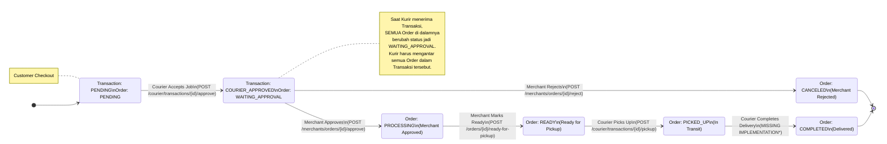

# Transaction & Order Flow

Dokumen ini menjelaskan alur transaksi (Transaction) dan pesanan (Order) di sistem Antarkanma, mulai dari pembauatan pesanan oleh Customer, penerimaan oleh Kurir, persetujuan Merchant, hingga penyelesaian.

## State Machine Diagram

Berikut adalah diagram alur status untuk **Transaction** dan **Order**.

---

## Detil Alur & Endpoint

### 1. Customer Checkout (Creation)
Customer membuat pesanan yang terdiri dari beberapa item, mungkin dari merchant yang berbeda. Sistem membuat 1 `Transaction` dan N `Order`.

*   **Endpoint**: `POST /api/transactions`
*   **Controller**: `TransactionController@create`
*   **Initial State**:
    *   `Transaction`: `PENDING` (Status), `PENDING` (Courier Approval)
    *   `Order`: `PENDING`
*   **Notification**: Broadast ke topik `new_transactions` (untuk Kurir).

### 2. Courier Assignment (Pencarian Kurir)
Kurir melihat daftar transaksi yang belum ada kurirnya (`COURIER_PENDING`) dan mengambil job tersebut.

*   **Endpoint**: `POST /api/courier/transactions/{id}/approve`
*   **Controller**: `CourierController@approveTransaction`
*   **Action**:
    *   Set `transaction.courier_id` = Kurir ID.
    *   Set `transaction.courier_approval` = `APPROVED`.
    *   Update **SEMUA** `Order` di transaksi tersebut menjadi `WAITING_APPROVAL`.
*   **Notification**:
    *   Ke Merchant: `transaction_approved` ("Transaksi Disetujui, ada order baru")
    *   Ke Customer: `courier_found` ("Kurir Ditemukan")

### 3. Merchant Approval (Persetujuan Restoran)
Merchant menerima notifikasi dan harus menyetujui atau menolak pesanan.

*   **Endpoint**: `POST /api/merchants/orders/{id}/approve` (atau `reject`)
*   **Controller**: `OrderController@approveOrder` / `rejectOrder`
*   **Action**:
    *   **Approve**: Set `order_status` = `PROCESSING`.
    *   **Reject**: Set `order_status` = `CANCELED`. (Jika semua order di reject, Transaksi ikut Cancel).
*   **Notification**:
    *   Ke Customer & Kurir: "Pesanan Disetujui/Ditolak".

### 4. Preparation (Merchant Masak)
Merchant menyiapkan pesanan. Setelah selesai, merchant menandai pesanan siap diambil.

*   **Endpoint**: `POST /api/orders/{id}/ready-for-pickup`
*   **Controller**: `OrderStatusController@readyForPickup` (Route: `POST /orders/{id}/ready-for-pickup`)
*   **Action**:
    *   Set `order_status` = `READY`.
*   **Notification**:
    *   Ke Kurir: `order_ready_for_pickup` ("Pesanan Siap Diambil").
    *   Ke Customer: `order_ready`.

### 5. Pickup (Kurir Ambil Barang)
Kurir datang ke merchant dan mengambil barang.

*   **Endpoint**: `POST /api/courier/transactions/{id}/pickup`
*   **Controller**: `CourierController@updateOrderStatus`
*   **Action**:
    *   Set `order_status` = `PICKED_UP`.
*   **Notification**:
    *   Ke Customer: `order_in_transit` ("Pesanan Dalam Perjalanan").

### 6. Delivery (Penyelesaian)
Kurir mengantar barang ke customer dan menyelesaikan pesanan.

> [!WARNING]
> **CRITICAL ISSUE FOUND**:
> Route `POST /api/courier/transactions/{id}/status` terdaftar di `api.php` mengarah ke `CourierController@updateTransactionStatus`, NAMUN method tersebut **TIDAK DITEMUKAN** di file `CourierController.php`.
>
> Akibatnya, Kurir tidak bisa menyelesaikan pesanan (Complete Order) via API ini.

*   **Recommendation**: Segera implementasikan method `updateTransactionStatus` di `CourierController.php` untuk menangani status `COMPLETED` atau `DELIVERED`.

---

## Catatan Penting
1.  **Structure**: 1 `Transaction` membungkus banyak `Order` (Multi-Merchant).
2.  **Courier Binding**: Kurir terikat pada level `Transaction` (mengantar semua order dalam satu trip), tapi status diproses per `Order`.
3.  **Timeout**: Transaksi yang tidak diambil kurir dalam 10 menit akan otomatis `CANCELED`.
