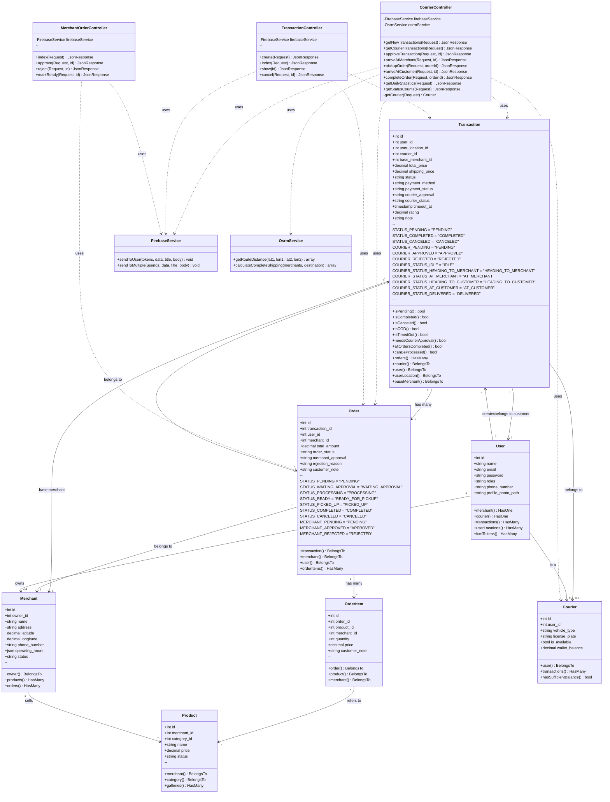
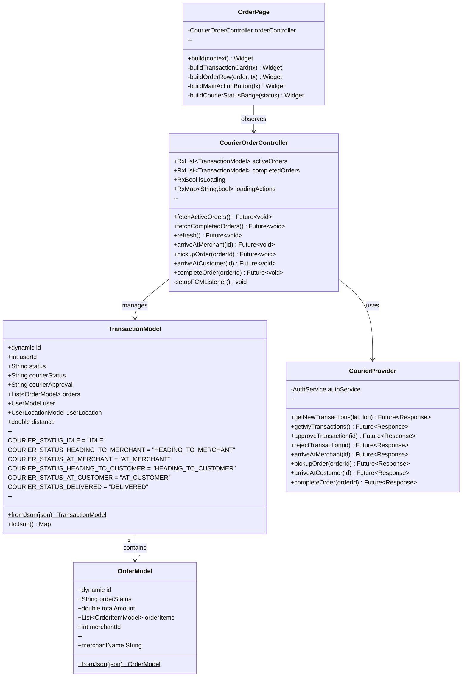

# Class Diagram — Antarkanma Backend

> **Versi**: v2.0 — 24 Februari 2026  
> Mencerminkan Laravel Models, Controllers, dan Services yang **aktual berjalan**.

---

## Backend Class Diagram

---

## Flutter App — Class Diagram (Courier App)

---

*Terakhir diperbarui: 24 Februari 2026*