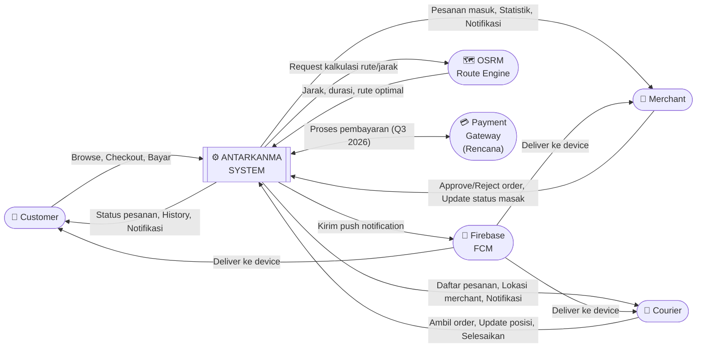

# DFD Level 0 — Antarkanma

> **Versi**: v2.0 — 24 Februari 2026  
> DFD Level 0 = **Context Diagram** — menunjukkan sistem secara keseluruhan dan semua entitas eksternal yang berinteraksi dengannya.

---

## Context Diagram

---

## Penjelasan Entitas Eksternal

| Entitas | Tipe | Interaksi dengan Sistem |
|---|---|---|
| **Customer** | User | Membuat pesanan, membayar, melacak status |
| **Merchant** | User | Menerima & memproses pesanan |
| **Courier** | User | Mengambil & mengantarkan pesanan |
| **Firebase FCM** | External Service | Push notification real-time ke semua aktor |
| **OSRM** | External Service | Kalkulasi jarak & rute untuk ongkir |
| **Payment Gateway** | External Service | Proses pembayaran online (Midtrans/Xendit, Q3 2026) |

---

## Data Flows Utama

### Input ke Sistem
| Dari | Data | Keterangan |
|---|---|---|
| Customer | Pesanan, lokasi pengiriman, pembayaran | Via REST API |
| Merchant | Keputusan approve/reject, update status masak | Via REST API |
| Courier | Keputusan ambil pesanan, update posisi/status | Via REST API |
| OSRM | Jarak & durasi antar titik | Untuk kalkulasi ongkir |

### Output dari Sistem
| Ke | Data | Keterangan |
|---|---|---|
| Customer | Konfirmasi pesanan, status real-time, history | REST API + FCM |
| Merchant | Pesanan masuk, statistik harian | REST API + FCM |
| Courier | Daftar pesanan tersedia, pendapatan | REST API + FCM |
| Firebase | Payload notifikasi | FCM push |

---

*Terakhir diperbarui: 24 Februari 2026*