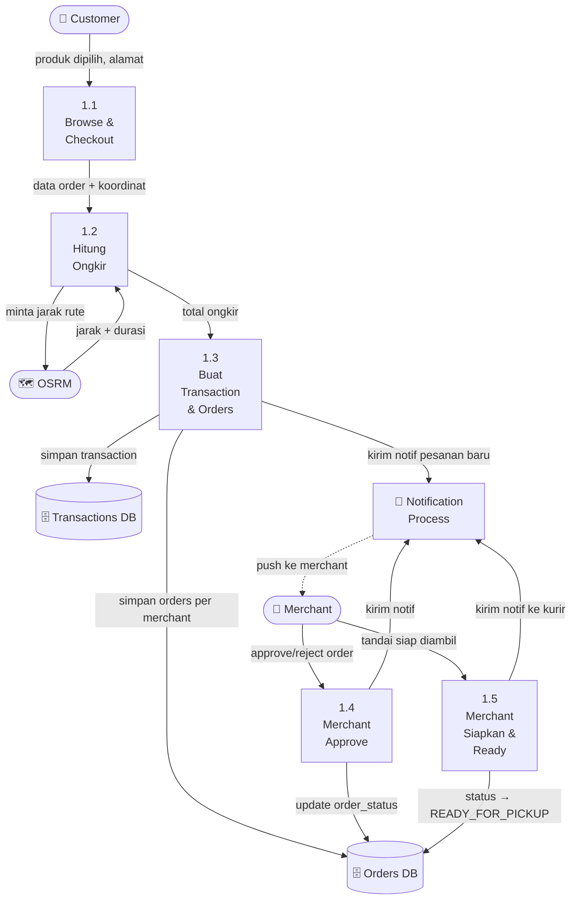
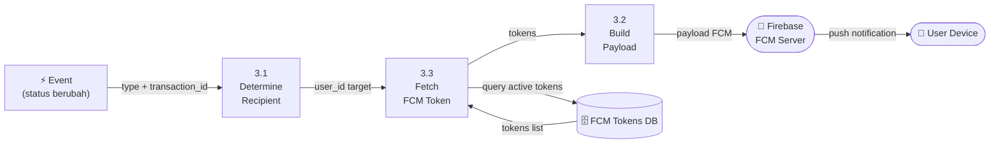
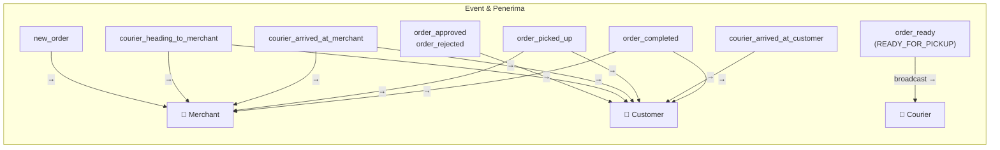

# DFD Level 1 — Antarkanma

> **Versi**: v2.0 — 24 Februari 2026  
> DFD Level 1 = Pemecahan proses utama ke sub-proses.  
> Tiga proses utama: (1) Order Management, (2) Courier Flow, (3) Notification System.

---

## Proses 1: Order Management

---

## Proses 2: Courier Flow

```mermaid
flowchart TD
    COURIER(["🛵 Courier"])
    CUSTOMER2(["👤 Customer"])
    MERCHANT2(["🏪 Merchant"])
    DB_TRX2[("🗄️ Transactions DB")]
    DB_ORDER2[("🗄️ Orders DB")]
    NOTIF2["🔔 Notification\nProcess"]

    P2_1["2.1\nLihat Pesanan\nTersedia"]
    P2_2["2.2\nTerima Pesanan\n(approve)"]
    P2_3["2.3\nSampai di\nMerchant"]
    P2_4["2.4\nPickup\nPer-Order"]
    P2_5["2.5\nSampai di\nCustomer"]
    P2_6["2.6\nSelesaikan\nPer-Order"]

    COURIER -->|"minta list pesanan READY"| P2_1
    P2_1 -->|"query READY_FOR_PICKUP"| DB_ORDER2
    DB_ORDER2 -->|"list pesanan + jarak"| P2_1
    P2_1 -->|"tampil ke kurir"| COURIER

    COURIER -->|"tap Terima"| P2_2
    P2_2 -->|"set courier_id + courier_status=HEADING_TO_MERCHANT"| DB_TRX2
    P2_2 -->|"⚠️ Order status TIDAK berubah (tetap READY)"| DB_ORDER2
    P2_2 -->|"notif ke merchant & customer"| NOTIF2

    COURIER -->|"tap Sampai di Merchant"| P2_3
    P2_3 -->|"courier_status=AT_MERCHANT"| DB_TRX2
    P2_3 -->|"notif ke merchant & customer"| NOTIF2

    COURIER -->|"tap Ambil (per order)"| P2_4
    P2_4 -->|"order_status=PICKED_UP"| DB_ORDER2
    P2_4 -->|"jika semua PICKED_UP: courier_status=HEADING_TO_CUSTOMER"| DB_TRX2
    P2_4 -->|"notif ke merchant & customer"| NOTIF2

    COURIER -->|"tap Sampai di Customer"| P2_5
    P2_5 -->|"courier_status=AT_CUSTOMER"| DB_TRX2
    P2_5 -->|"notif ke customer"| NOTIF2

    COURIER -->|"tap Selesai (per order)"| P2_6
    P2_6 -->|"order_status=COMPLETED"| DB_ORDER2
    P2_6 -->|"jika semua done: Transaction=COMPLETED, DELIVERED"| DB_TRX2
    P2_6 -->|"notif ke merchant & customer"| NOTIF2

    NOTIF2 -.->|"push"| CUSTOMER2
    NOTIF2 -.->|"push"| MERCHANT2
```

---

## Proses 3: Notification System

### Tipe Notifikasi & Penerima

---

## Data Stores (Tabel Database Utama)

| Store | Tabel | Fungsi |
|---|---|---|
| D1 | `transactions` | Status transaksi + courier tracking |
| D2 | `orders` | Status per order per merchant |
| D3 | `order_items` | Detail produk dalam pesanan |
| D4 | `fcm_tokens` | Token FCM per device per user |
| D5 | `users` | Data semua aktor |
| D6 | `merchants` | Profil + koordinat merchant |
| D7 | `couriers` | Profil + kondisi kurir |
| D8 | `user_locations` | Alamat pengiriman customer |

---

*Terakhir diperbarui: 24 Februari 2026*