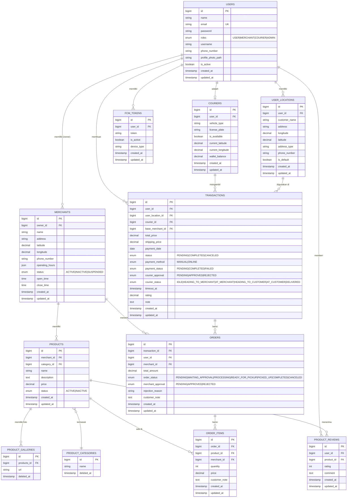

# ERD Diagram — Antarkanma

> **Versi**: v2.0 — Diperbarui 24 Februari 2026  
> **Sumber kebenaran**: Migrations aktual di `database/migrations/`  
> Diagram ini mencerminkan schema **aktual** yang sedang berjalan, bukan desain lama.

---

## Entity Relationship Diagram (Mermaid)



---

## Penjelasan Entitas Utama

### 🔑 Hierarki Pesanan

```
TRANSACTIONS  (1 per pembayaran)
    └── ORDERS  (1 per merchant)
            └── ORDER_ITEMS  (1 per produk)
```

**Satu Transaction bisa memiliki beberapa Order** (kalau customer pesan dari beberapa merchant sekaligus). Tapi **satu Order hanya untuk satu merchant** dan hanya belongTo satu Transaction.

---

### TRANSACTIONS — Field Penting

| Field | Tipe | Deskripsi |
|---|---|---|
| `status` | ENUM | Status transaksi keseluruhan: PENDING / COMPLETED / CANCELED |
| `courier_approval` | ENUM | Apakah kurir sudah menerima: PENDING / APPROVED / REJECTED |
| `courier_status` | ENUM | **BARU:** Posisi kurir secara real-time (tracking) |
| `courier_id` | FK | Null = belum ada kurir; sudah isi = kurir sudah ambil |
| `base_merchant_id` | FK | Merchant utama (terjauh / pertama) untuk hitung ongkir |
| `timeout_at` | timestamp | Deadline order — saat ini tidak auto-cancel |

### courier_status — State Machine

```
IDLE → HEADING_TO_MERCHANT → AT_MERCHANT → HEADING_TO_CUSTOMER → AT_CUSTOMER → DELIVERED
```

| Value | Kondisi |
|---|---|
| `IDLE` | Belum ada kurir, atau default |
| `HEADING_TO_MERCHANT` | Kurir sudah terima, sedang menuju merchant |
| `AT_MERCHANT` | Kurir sudah tiba di merchant |
| `HEADING_TO_CUSTOMER` | Semua order sudah diambil, menuju customer |
| `AT_CUSTOMER` | Kurir sudah tiba di lokasi customer |
| `DELIVERED` | Semua order selesai diantarkan |

---

### ORDERS — order_status State Machine

```
PENDING → WAITING_APPROVAL → PROCESSING → READY_FOR_PICKUP → PICKED_UP → COMPLETED
                    ↓                                                   
                CANCELED  (bisa dari mana saja selain COMPLETED)
```

| Status | Siapa yang mengubah | Kondisi |
|---|---|---|
| `PENDING` | System | Saat customer checkout |
| `WAITING_APPROVAL` | System | Langsung setelah PENDING (auto) |
| `PROCESSING` | Merchant | Setelah merchant approve |
| `READY_FOR_PICKUP` | Merchant | Setelah makanan selesai disiapkan |
| `PICKED_UP` | Courier | Setelah kurir ambil dari merchant |
| `COMPLETED` | Courier | Setelah berhasil diantarkan ke customer |
| `CANCELED` | Merchant / System | Jika ditolak atau gagal |

---

## Tabel Migrasi Aktual

| Tabel | File Migration |
|---|---|
| `users` | `0001_01_01_000000_create_users_table.php` |
| `merchants` | `2024_10_20_101729_create_merchants_table.php` |
| `products` | `2024_10_20_102058_create_products_table.php` |
| `orders` (lama, bukan parent) | `2024_10_20_103008_create_orders_table.php` |
| `transactions` | `2024_10_20_113547_create_transactions_table.php` |
| `couriers` | `2024_10_20_122829_create_couriers_table.php` |
| `user_locations` | `2024_10_20_132008_create_user_locations_table.php` |
| `fcm_tokens` | `2024_02_14_000000_create_fcm_tokens_table.php` |
| `courier_approval` + `timeout_at` | `2025_01_23_150506_add_courier_approval_...php` |
| **`courier_status`** | **`2026_02_24_add_courier_status_to_transactions.php`** |

---

*Terakhir diperbarui: 24 Februari 2026 — Sinkron dengan implementasi aktual*