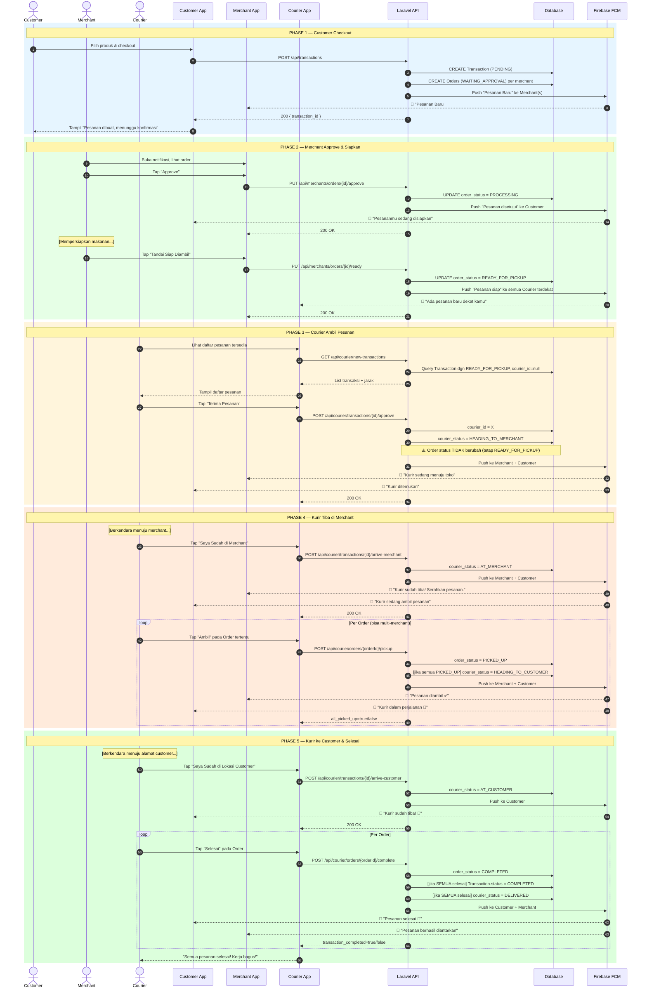
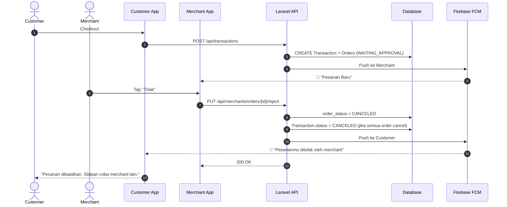

# Sequence Diagram — Antarkanma

> **Versi**: v2.0 — 24 Februari 2026  
> Sequence diagram untuk alur utama: Order flow lengkap dari Customer checkout hingga Delivered.

---

## Sequence Diagram: Full Order Flow (Happy Path)

---

## Sequence Diagram: Merchant Reject Flow

---

*Terakhir diperbarui: 24 Februari 2026*