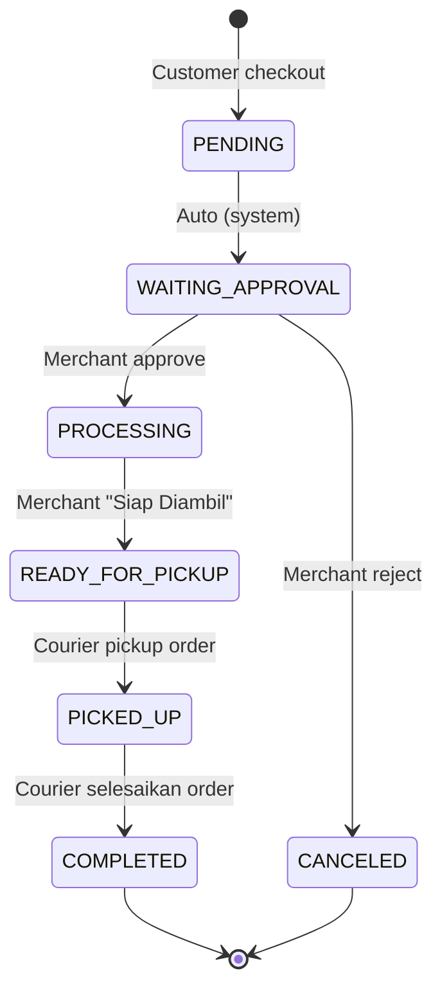
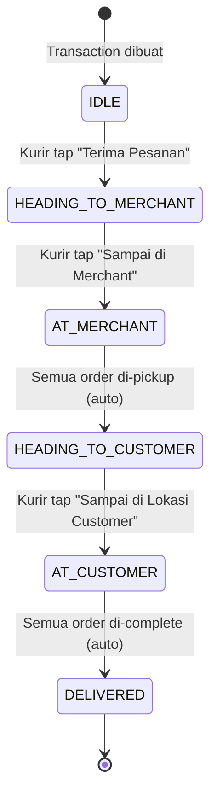

# Transaction & Order Flow — Antarkanma

> **Versi**: v2.0 — Diperbarui 24 Februari 2026
> Dokumen ini mencerminkan **implementasi aktual** sistem Hybrid Flow Antarkanma.

---

## 1. Konsep: Hybrid Flow

Antarkanma menggunakan **Hybrid Flow** — berbeda dari GoFood/GrabFood:

| Aspek | GoFood/GrabFood | Antarkanma (Hybrid) |
|---|---|---|
| Urutan | Kurir dulu, merchant masak | Merchant masak dulu, **baru** kurir dicarikan |
| Kurir lihat order | Kapan saja | **Hanya setelah makanan READY** |
| Risk | Kurir nunggu makanan | Makanan nunggu kurir (mais cepat pickup) |

> **Alasan desain**: Meminimalisir waktu tunggu kurir di merchant, karena makanan sudah siap saat kurir tiba.

---

## 2. Struktur Data

### Hierarki

```
TRANSACTION  (1x per pembayaran customer)
├── courier_id         → kurir yang menangani seluruh transaksi
├── courier_status     → posisi/tahap kurir saat ini
│
└── ORDER (1x per merchant)
    ├── merchant_id    → merchant yang memproses
    ├── order_status   → status masak/antar
    │
    └── ORDER_ITEM (1x per produk)
```

> **1 Transaction = 1 Kurir** mengantar ke semua merchant. Kurir tidak bisa mengambil sebagian saja.

### Tabel Status Lengkap

#### Transaction — `status`
| Value | Arti |
|---|---|
| `PENDING` | Customer sudah checkout, menunggu semua selesai |
| `COMPLETED` | **Auto** — semua order selesai diantar |
| `CANCELED` | Dibatalkan (timeout / merchant reject semua) |

#### Transaction — `courier_status` *(Baru Feb 2026)*
| Value | Arti | Diset oleh |
|---|---|---|
| `IDLE` | Default, belum ada kurir | System |
| `HEADING_TO_MERCHANT` | Kurir sudah terima, menuju merchant | Kurir (tap Terima) |
| `AT_MERCHANT` | Kurir sudah di merchant | Kurir (tap "Sampai di Merchant") |
| `HEADING_TO_CUSTOMER` | Semua order diambil, menuju customer | System (auto) |
| `AT_CUSTOMER` | Kurir sudah di lokasi customer | Kurir (tap "Sampai di Customer") |
| `DELIVERED` | Semua order selesai diantarkan | System (auto) |

#### Order — `order_status`
| Value | Arti | Diset oleh |
|---|---|---|
| `PENDING` | Baru dibuat | System |
| `WAITING_APPROVAL` | Menunggu merchant approve | System (auto setelah PENDING) |
| `PROCESSING` | Merchant sedang siapkan | Merchant (tap Approve) |
| `READY_FOR_PICKUP` | Siap diambil kurir | Merchant (tap "Siap Diambil") |
| `PICKED_UP` | Sudah diambil kurir | Courier (tap "Ambil") |
| `COMPLETED` | Sudah sampai ke customer | Courier (tap "Selesai") |
| `CANCELED` | Dibatalkan | Merchant / System |

---

## 3. Flow Lengkap — State Machine

### 3.1 Order State Machine



### 3.2 Transaction courier_status State Machine



---

## 4. Alur Per Aktor

### 👤 Customer App

```
1. Browse produk dari satu/banyak merchant
2. Tambah ke Cart
3. Checkout → Pilih alamat
4. Sistem hitung ongkir (OSRM service)
5. Transaction dibuat (status: PENDING)
   └── Order per merchant dibuat (status: WAITING_APPROVAL)
6. Customer menunggu notifikasi...

Notifikasi yang diterima:
  🔔 "Merchant approve pesanan" → order: PROCESSING
  🔔 "Makanan siap" → order: READY_FOR_PICKUP
  🔔 "Kurir ditemukan" → courier_status: HEADING_TO_MERCHANT
  🔔 "Kurir sudah di merchant" → courier_status: AT_MERCHANT
  🔔 "Kurir dalam perjalanan" → courier_status: HEADING_TO_CUSTOMER
  🔔 "Kurir sudah tiba!" → courier_status: AT_CUSTOMER
  🔔 "Pesanan selesai 🎉" → order: COMPLETED
```

### 🏪 Merchant App

```
1. Terima notifikasi "Pesanan Baru #XXX"
2. Lihat detail order di tab "Masuk" (status: WAITING_APPROVAL)
3. Review → pilih:
   ✅ APPROVE  → order: PROCESSING
   ❌ REJECT   → order: CANCELED

4. Siapkan makanan (status: PROCESSING)
5. Tap "Tandai Siap Diambil"
   → order: READY_FOR_PICKUP
   → Pesanan muncul di list kurir

Notifikasi yang diterima:
  🔔 "Pesanan Baru"    → Segera buka app
  🔔 "Kurir Menuju 🛵" → courier_status: HEADING_TO_MERCHANT (siap-siap)
  🔔 "Kurir Sudah Tiba! 📦" → courier_status: AT_MERCHANT (serahkan)
  🔔 "Pesanan Diambil ✅"   → order: PICKED_UP
  🔔 "Pesanan Selesai 🎉"   → order: COMPLETED
```

### 🛵 Courier App

```
1. Buka tab "Pesanan Baru"
   → GET /api/courier/new-transactions
   → Hanya tampil transaksi dengan semua order READY_FOR_PICKUP

2. Lihat detail + jarak dari posisi kurir ke merchant
3. Tap "Terima Pesanan"
   → POST /api/courier/transactions/{id}/approve
   → courier_status: HEADING_TO_MERCHANT
   ⚠️  Order status TIDAK berubah (tetap READY_FOR_PICKUP)

4. Sampai di merchant → Tap "Saya Sudah di Merchant"
   → POST /api/courier/transactions/{id}/arrive-merchant
   → courier_status: AT_MERCHANT

5. Pickup setiap order dari merchant:
   Per order: Tap "Ambil"
   → POST /api/courier/orders/{orderId}/pickup
   → order_status: PICKED_UP
   (Jika semua order PICKED_UP → auto: HEADING_TO_CUSTOMER)

6. Sampai di customer → Tap "Saya Sudah di Lokasi Customer"
   → POST /api/courier/transactions/{id}/arrive-customer
   → courier_status: AT_CUSTOMER

7. Serahkan & selesaikan per order:
   Per order: Tap "Selesai"
   → POST /api/courier/orders/{orderId}/complete
   → order_status: COMPLETED
   (Jika semua order COMPLETED → auto: Transaction COMPLETED + DELIVERED)
```

---

## 5. API Endpoints

### Customer
| Method | Endpoint | Deskripsi |
|---|---|---|
| POST | `/api/transactions` | Buat transaksi baru |
| GET | `/api/transactions` | List transaksi customer |
| GET | `/api/transactions/{id}` | Detail transaksi |
| PUT | `/api/transactions/{id}/cancel` | Batalkan transaksi |

### Merchant
| Method | Endpoint | Deskripsi |
|---|---|---|
| GET | `/api/merchant/{id}/orders` | List order merchant |
| PUT | `/api/merchants/orders/{id}/approve` | Approve order |
| PUT | `/api/merchants/orders/{id}/reject` | Reject order |
| PUT | `/api/merchants/orders/{id}/ready` | Tandai siap diambil |

### Courier *(Endpoints terbaru)*
| Method | Endpoint | Deskripsi |
|---|---|---|
| GET | `/api/courier/new-transactions` | Pesanan tersedia (READY) |
| GET | `/api/courier/my-transactions` | Pesanan saya |
| POST | `/api/courier/transactions/{id}/approve` | Terima pesanan |
| POST | `/api/courier/transactions/{id}/reject` | Tolak pesanan |
| POST | `/api/courier/transactions/{id}/arrive-merchant` | **Baru:** Sampai di merchant |
| POST | `/api/courier/transactions/{id}/arrive-customer` | **Baru:** Sampai di customer |
| POST | `/api/courier/orders/{id}/pickup` | **Baru:** Pickup per-order |
| POST | `/api/courier/orders/{id}/complete` | **Baru:** Selesaikan per-order |

---

## 6. Notifikasi Matrix (FCM)

| Event | Notif ke | Tipe | Isi |
|---|---|---|---|
| Pesanan dibuat | Merchant | `new_order` | "Ada pesanan baru #X" |
| Merchant approve | Customer | `order_approved` | "Pesananmu sedang disiapkan" |
| Merchant reject | Customer | `order_rejected` | "Pesananmu ditolak" |
| Order READY | Courier (broadcast) | `order_ready` | "Ada pesanan baru dekat kamu" |
| Kurir terima | Merchant | `courier_heading_to_merchant` | "Kurir sedang menuju toko" |
| Kurir terima | Customer | `courier_found` | "Kurir ditemukan" |
| Kurir di merchant | Merchant | `courier_arrived_at_merchant` | "Kurir sudah tiba!" |
| Kurir di merchant | Customer | `courier_at_merchant` | "Kurir sedang ambil pesanan" |
| Order PICKED_UP | Merchant | `order_picked_up` | "Pesanan sudah diambil" |
| Order PICKED_UP | Customer | `order_picked_up` | "Kurir dalam perjalanan 🚀" |
| Kurir di customer | Customer | `courier_arrived_at_customer` | "Kurir sudah tiba! 🎉" |
| Order COMPLETED | Customer | `order_completed` | "Pesanan selesai 🎉" |
| Order COMPLETED | Merchant | `order_completed` | "Pesanan #X berhasil diantarkan" |

---

## 7. Business Rules

1. **1 Transaksi = 1 Kurir** — tidak bisa dibagi ke beberapa kurir
2. **Kurir ambil semua atau tidak sama sekali** — tidak ada partial pickup di level transaksi
3. **Pickup bisa partial per-order** — untuk multi-merchant, kurir bisa ambil order satu-satu
4. **Auto-complete Transaction** — saat semua order COMPLETED/CANCELED, Transaction otomatis COMPLETED
5. **Order tidak bisa mundur statusnya** — state machine satu arah, kecuali CANCELED
6. **Kurir hanya lihat READY_FOR_PICKUP** — pesanan yang masih PROCESSING tidak muncul di list kurir

---

*Terakhir diperbarui: 24 Februari 2026*
